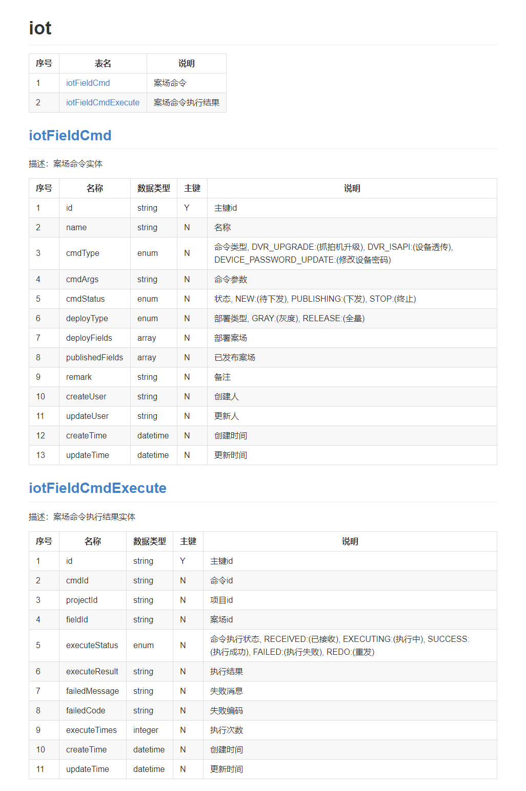

# mongodoc-gen-intellij-plugin
Generate mongodb database documents from the spring-data-mongodb entity class.

一键生成mongodb数据库文档.

## 使用
**English:**
- Install plugin: `Mongodoc Gen`
- Add @Document annotation and Javadoc document comment to entity class
- Select the right-click menu of the module and execute "Generate mongodb Doc"
- Generated documents in module path "target/mongodoc-gen"

**中文:**
- 安装插件: `Mongodoc Gen`
- 实体类上添加@Document注解和标准的Javadoc文档注释
- 项目视图选中源代码模块，执行"Generate mongodb Doc"
- 生成的文档在模块目录下"target/mongodoc-gen"

## 文档截图

